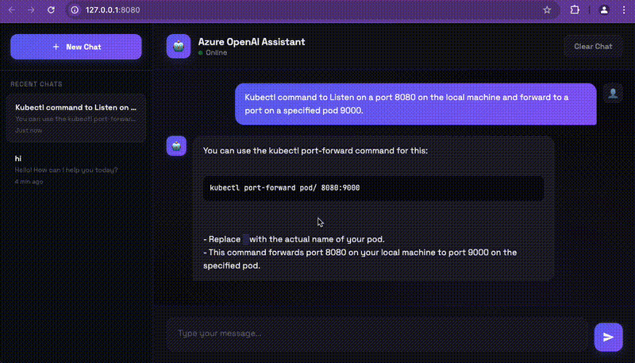
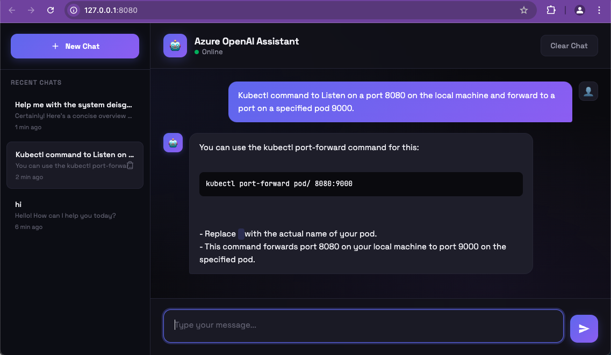

# Azure OpenAI Chatbot

A modern, feature-rich desktop chatbot application powered by Azure OpenAI. Built with Python Flask backend and a sleek web-based interface.


## 🎬 Demo

<p align="center">
  
</p>

> *See the chatbot in action - modern UI, real-time responses, and session management*

## Features

- **Modern Dark UI** - Sleek, responsive interface with purple/indigo accents and ambient gradients
- **Multi-Session Chat History** - Maintains up to 5 recent chat sessions in the sidebar
- **Persistent Storage** - Chat history survives browser refreshes and restarts (localStorage)
- **Real-time Responses** - Streaming-style UI with typing indicators
- **Markdown Support** - Code blocks, inline code, and bold text formatting
- **Session Management**:
  - Create new chat sessions
  - Switch between past conversations
  - Delete individual sessions
  - Clear current chat
- **Error Handling** - Graceful error messages with toast notifications
- **Responsive Design** - Works on desktop and mobile browsers

## Prerequisites

- Python 3.8 or higher
- Azure OpenAI resource with a deployed model
- Azure OpenAI API key and endpoint

## Installation

1. **Clone or navigate to the project directory**:
   ```bash
   cd openai-chatbot
   ```

2. **Create a virtual environment** (recommended):
   ```bash
   python -m venv venv
   source venv/bin/activate  # On Windows: venv\Scripts\activate
   ```

3. **Install dependencies**:
   ```bash
   pip install -r requirements.txt
   ```

4. **Configure Azure OpenAI credentials** (see Configuration section below)

5. **Run the application**:
   ```bash
   python main.py
   ```

6. **Open your browser** at `http://127.0.0.1:8080` (opens automatically)

## Configuration

Edit the `config.py` file with your Azure OpenAI credentials:

```python
# Azure OpenAI Configuration
AZURE_OPENAI_ENDPOINT = "https://your-resource-name.openai.azure.com/"
AZURE_OPENAI_KEY = "your-azure-openai-key-here"
AZURE_OPENAI_DEPLOYMENT = "your-deployment-name"  # NOT the model name
AZURE_OPENAI_API_VERSION = "2024-02-15-preview"
```

### Finding Your Azure OpenAI Credentials

| Credential | Where to Find |
|------------|---------------|
| **Endpoint** | Azure Portal → Your OpenAI Resource → Keys and Endpoint |
| **API Key** | Azure Portal → Your OpenAI Resource → Keys and Endpoint → Key 1 or Key 2 |
| **Deployment Name** | Azure AI Foundry → Deployments → Name column (this is the custom name you gave when deploying a model) |
| **API Version** | Use `2024-02-15-preview` or check [Azure docs](https://learn.microsoft.com/en-us/azure/ai-services/openai/reference) for latest |

> **Note**: The deployment name is NOT the same as the model name (e.g., "gpt-4"). It's the custom name you assigned when creating a deployment in Azure AI Foundry.

## Project Structure

```
openai-chatbot/
├── main.py              # Flask application backend
├── config.py            # Azure OpenAI configuration
├── requirements.txt     # Python dependencies
├── README.md            # This file
└── templates/
    └── index.html       # Frontend UI (HTML/CSS/JS)
```

## Usage

### Starting a New Chat
Click the **"+ New Chat"** button in the sidebar to start a fresh conversation.

### Switching Between Chats
Click on any chat session in the left sidebar to load that conversation.

### Deleting a Chat
Hover over a chat session and click the trash icon to delete it.

### Clearing Current Chat
Click the **"Clear Chat"** button in the header to clear messages in the current session (keeps the session).

### Keyboard Shortcuts
- **Enter** - Send message
- **Shift + Enter** - New line in message

## API Endpoints

| Endpoint | Method | Description |
|----------|--------|-------------|
| `/` | GET | Serves the chat interface |
| `/chat` | POST | Sends a message and returns AI response |
| `/clear` | POST | Clears the server-side conversation (deprecated, client-side only now) |

### Chat Request Format
```json
{
  "message": "Your message here",
  "history": [
    {"role": "user", "content": "Previous user message"},
    {"role": "assistant", "content": "Previous AI response"}
  ]
}
```

### Chat Response Format
```json
{
  "response": "AI generated response"
}
```

## Troubleshooting

### Common Issues

| Issue | Solution |
|-------|----------|
| **403 Forbidden** | Usually a browser cache issue. Try hard refresh (Cmd+Shift+R) or different browser |
| **Request Timeout** | Check your Azure OpenAI deployment name is correct. Timeout is set to 60 seconds |
| **DeploymentNotFound** | Your `AZURE_OPENAI_DEPLOYMENT` value doesn't match any deployment in Azure |
| **401 Unauthorized** | Invalid API key. Check `AZURE_OPENAI_KEY` in config.py |
| **tkinter error** | Ignore - the app uses Flask web UI, not tkinter |

### Checking Server Logs
The Flask server prints logs to the terminal. Look for error messages when requests fail.

## Dependencies

- **openai** (>=1.0.0) - Azure OpenAI Python SDK
- **flask** (>=3.0.0) - Web framework
- **httpx** - HTTP client (dependency of openai)

## Security Notes

⚠️ **Important**: 
- Never commit `config.py` with real credentials to version control
- Add `config.py` to `.gitignore` in production
- Consider using environment variables for sensitive data:

```python
import os

AZURE_OPENAI_ENDPOINT = os.getenv("AZURE_OPENAI_ENDPOINT")
AZURE_OPENAI_KEY = os.getenv("AZURE_OPENAI_KEY")
AZURE_OPENAI_DEPLOYMENT = os.getenv("AZURE_OPENAI_DEPLOYMENT")
AZURE_OPENAI_API_VERSION = os.getenv("AZURE_OPENAI_API_VERSION", "2024-02-15-preview")
```

## Customization

### Changing the System Prompt
Edit the system message in `main.py`:

```python
conversation_history = [
    {"role": "system", "content": "Your custom system prompt here"}
]
```

### Modifying the UI
Edit `templates/index.html` to customize:
- Colors (CSS variables in `:root`)
- Fonts (Google Fonts link)
- Layout (Flexbox-based)
- Number of saved sessions (`MAX_SESSIONS` in JavaScript)

## Screenshots

<p align="center">
  
</p>
<p align="center"><em>Main chat interface with sidebar navigation</em></p>

<br>

<p align="center">
  
</p>
<p align="center"><em>Active conversation with AI responses</em></p>

## License

MIT License - feel free to use and modify for your projects.

## Contributing

Contributions are welcome! Please feel free to submit issues or pull requests.

---

Built with ❤️ using Azure OpenAI and Flask

